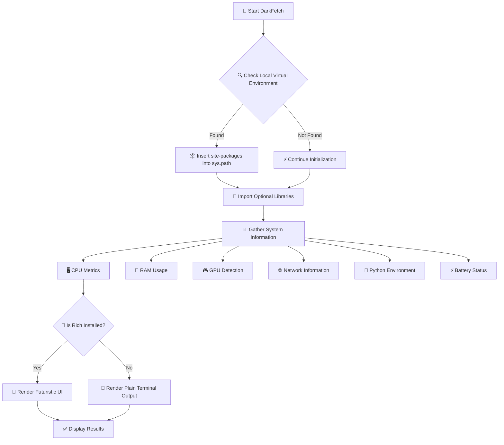
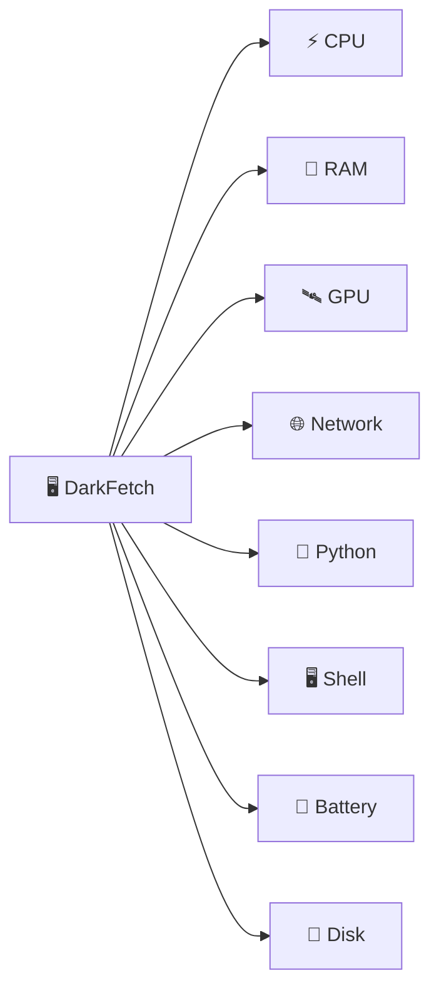
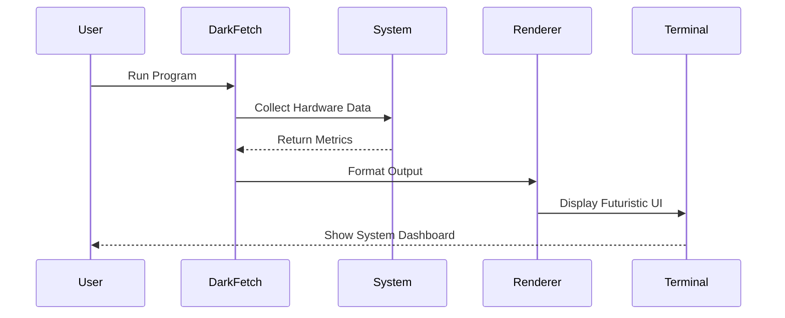
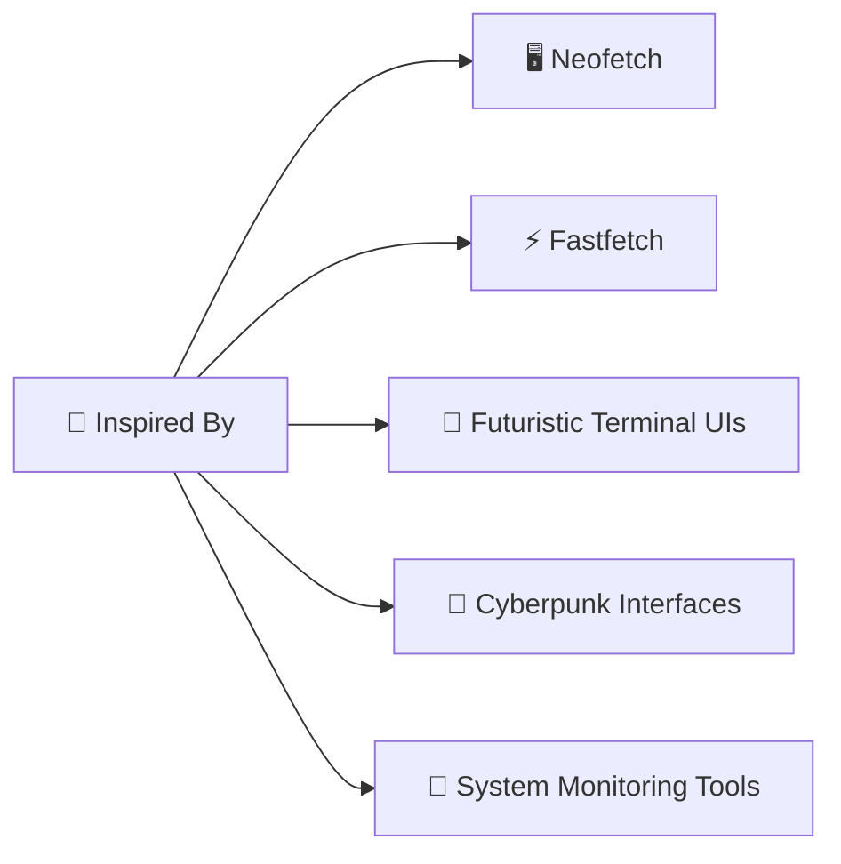

<div align="center">


<pre>
██████╗  █████╗ ██████╗ ██╗  ██╗    ███████╗███████╗████████╗ ██████╗██╗  ██╗
██╔══██╗██╔══██╗██╔══██╗██║ ██╔╝    ██╔════╝██╔════╝╚══██╔══╝██╔════╝██║  ██║
██║  ██║███████║██████╔╝█████╔╝     █████╗  █████╗     ██║   ██║     ███████║
██║  ██║██╔══██║██╔══██╗██╔═██╗     ██╔══╝  ██╔══╝     ██║   ██║     ██╔══██║
██████╔╝██║  ██║██║  ██║██║  ██╗    ██║     ███████╗   ██║   ╚██████╗██║  ██║
╚═════╝ ╚═╝  ╚═╝╚═╝  ╚═╝╚═╝  ╚═╝    ╚═╝     ╚══════╝   ╚═╝    ╚═════╝╚═╝  ╚═╝
</pre>

<br>


<br><br>


<br><br>

<a href="https://github.com/Dark-Vinaal/Dark_Fetch">
  
</a>

</div>


## 🌌 DarkFetch

> A futuristic Python-based system information fetch utility designed with modern terminal aesthetics, real-time hardware insights, and beautifully rendered output.

DarkFetch gathers:
- 🧠 Hardware Information
- ⚡ Resource Utilization
- 🌐 Network Details
- 🖥️ Software Environment Data
- 🚀 System Metrics

and displays them in a sleek cyberpunk-inspired terminal interface.


## ✨ Features

<div align="center">

| ⚡ Feature | 🌌 Description |
|---|---|
| 🎨 Rich Terminal UI | Beautiful styling powered by `rich` |
| 🧠 Hardware Monitoring | CPU, RAM, Disk, GPU, Battery |
| 🌐 Network Detection | Local IP & system networking |
| 🐍 Python Environment Detection | Detects venv & Conda |
| 🖥️ OS & Shell Detection | Kernel, distro, shell, terminal |
| ⚛️ Dynamic Progress Bars | Modern resource indicators |
| 🚀 Automatic Fallback System | Works even without optional libs |
| 🛰️ Lightweight Architecture | Single optimized Python script |

</div>


## ⚛️ System Architecture




## 🧠 Information Collected




## 🎨 Design Philosophy

```txt
Minimal Terminal UI
        +
Cyberpunk Aesthetic
        +
Real-Time System Data
        +
Rich Styling
        +
Lightweight Python Architecture
        =
DARKFETCH
```


## 🚀 Installation

### 📦 Clone Repository

```bash
git clone https://github.com/Dark-Vinaal/Dark_Fetch.git
cd Dark_Fetch
```

### 🐍 Create Virtual Environment

```bash
python3 -m venv .venv
source .venv/bin/activate
```

### ⚡ Install Recommended Dependencies

```bash
pip install rich psutil GPUtil
```


## 💻 Usage

### 🚀 Run DarkFetch

```bash
python darkfetch.py
```

> For Live preview, checkout the image attached below


## ⚛️ Dependency Fallback System

- DarkFetch is designed to gracefully degrade functionality depending on installed libraries.

| Dependency | Purpose | Fallback |
|---|---|---|
| `rich` | Styled terminal rendering | Plain text mode |
| `psutil` | Hardware statistics | OS-level checks |
| `GPUtil` | Nvidia GPU detection | `lspci` GPU parsing |


## 🛰️ Rendering Pipeline




## 📂 Project Structure

```txt
📦 Dark_Fetch/
│
├── 🐍 darkfetch.py
├── 🖼️ assets/
├── 📄 README.md
├── ⚖️ LICENSE
└── 📦 requirements.txt
```


## 🌌 Core Technologies

<div align="center">


</div>


## 🧠 Supported Platforms

| Platform | Status |
|---|---|
| 🐧 Linux | ✅ Fully Supported |
| 🍎 macOS | ✅ Supported |
| 🪟 Windows | ⚠️ Partial Compatibility |


## 💻 Live Preview

<div align="center">


</div>


## 🌌 Inspiration




## 🧠 Future Upgrades

- 🌌 Animated terminal rendering
- ⚛️ Better GPU telemetry
- 📊 Real-time monitoring mode
- 🛰️ Plugin architecture
- 🔥 Cross-platform optimization
- 🤖 Interactive dashboard mode


## 👨‍🚀 Developer

<div align="center">

# Vinaal R

### Creative Developer • Terminal UI Enthusiast • Futuristic Interface Explorer


</div>


## 🌐 Connect

<div align="center">

<a href="https://github.com/Dark-Vinaal">
  
</a>

<a href="https://www.linkedin.com/in/vinaal">
  
</a>


</div>
