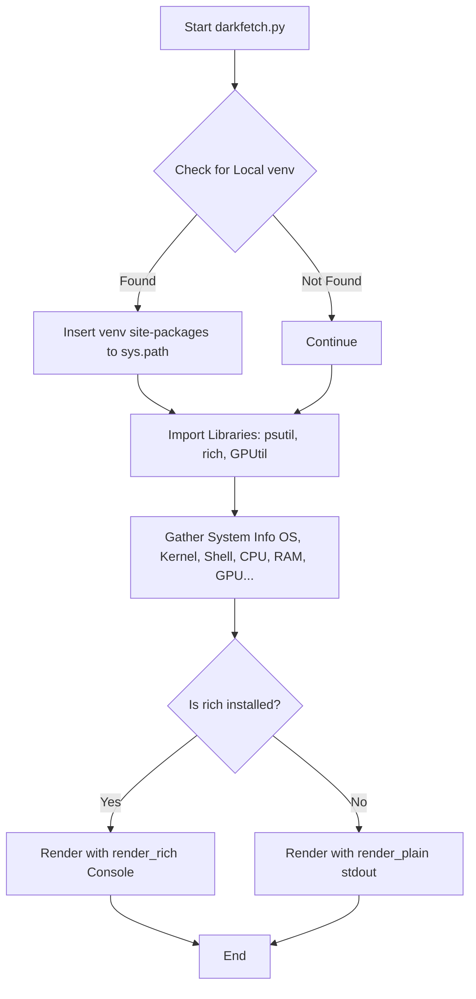

# 🛠️ DarkFetch

`DarkFetch` is a sleek, lightweight system information fetcher written in Python. It gathers key system details, hardware specs, and resource utilization metrics, displaying them in a beautifully formatted terminal output with custom ASCII progress bars and vibrant styling.

```text
  ██████╗  █████╗ ██████╗ ██╗  ██╗    ███████╗███████╗████████╗ ██████╗██╗  ██╗
  ██╔══██╗██╔══██╗██╔══██╗██║ ██╔╝    ██╔════╝██╔════╝╚══██╔══╝██╔════╝██║  ██║
  ██║  ██║███████║██████╔╝█████╔╝     █████╗  █████╗     ██║   ██║     ███████║
  ██║  ██║██╔══██║██╔══██╗██╔═██╗     ██╔══╝  ██╔══╝     ██║   ██║     ██╔══██║
  ██████╔╝██║  ██║██║  ██║██║  ██╗    ██║     ███████╗   ██║   ╚██████╗██║  ██║
  ╚═════╝ ╚═╝  ╚═╝╚═╝  ╚═╝╚═╝  ╚═╝   ╚═╝     ╚══════╝   ╚═╝    ╚═════╝╚═╝  ╚═╝
```

---

## ✨ Features

- **Rich Visual Output**: Utilizes the `rich` library for terminal colors, styles, and modern formatting. Automatically falls back to a clean plain-text renderer if `rich` is not installed.
- **Hardware & Resource Monitoring**:
  - **CPU**: Model info, core/thread count, and real-time usage indicator.
  - **RAM**: Memory usage and totals with visually dynamic bar charts.
  - **Swap**: Swap space utilization.
  - **Disk**: Partition usage and totals for root (`/`).
  - **GPU**: Auto-detection (supports exact Nvidia GPU details when `GPUtil` is available, falls back to `lspci`).
  - **Battery**: Battery charge percentage and charging status.
- **Software Environment Info**:
  - **OS & Kernel**: Detailed Linux distribution detection (reads `/etc/os-release`) or macOS versioning.
  - **Shell & Terminal**: Detects active shell, version, and current terminal emulator (via environment variables or process tree traversal).
  - **Package Counts**: Package details for `pacman`, `apt`, and `pip`.
  - **Python Environment**: Detects active virtual environment (`venv` or `Conda`).
- **Network**: Displays active local IP address.
- **Automatic Sandbox Loading**: Built-in logic checks for local virtual environments (`.venv/darkfetch`) and automatically inserts its `site-packages` into the search path.

---

## 🚀 Getting Started

### Prerequisites

DarkFetch runs on **Python 3.6+**. While it can run with no external dependencies (in plain-text mode), installing the recommended libraries unlocks full functionality and beautiful colors.

### Installation

1. **Clone the repository**:
   ```bash
   git clone https://github.com/yourusername/Fetch.git
   cd Fetch
   ```

2. **Set up a Virtual Environment** (Optional but Recommended):
   ```bash
   python3 -m venv .venv
   source .venv/bin/activate
   ```

3. **Install Dependencies**:
   To install all recommended packages for rich styling and full hardware inspection:
   ```bash
   pip install rich psutil GPUtil
   ```

---

## 💻 Usage

Run the script directly from your terminal:

```bash
python darkfetch.py
```

### Dependency Fallbacks

- If **`rich`** is missing, the script prints a standard plain-text version with a tip to install it.
- If **`psutil`** is missing, resource usage details (CPU, RAM, Swap, Disk) will fall back to OS-level checks (e.g. `/proc` systems on Linux) where possible.
- If **`GPUtil`** is missing, GPU details will fall back to standard Linux `lspci` graphics card listings.

---

## 🛠️ Architecture

DarkFetch is contained in a single, highly optimized script [darkfetch.py](file:///home/vinaal/Documents/Projects/Fetch/darkfetch.py). Here is how the gather-and-render flow works:



---

## 📄 License

This project is licensed under the MIT License - see the LICENSE file for details.
